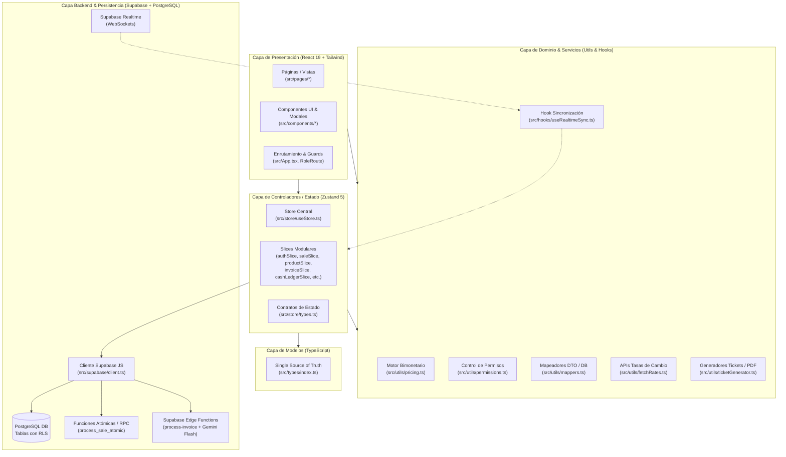
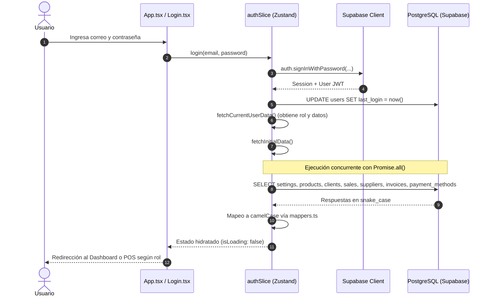
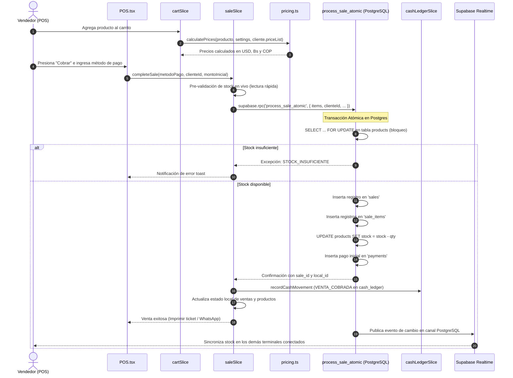
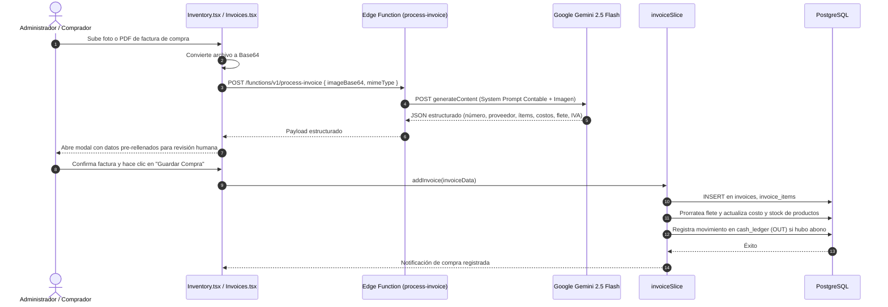
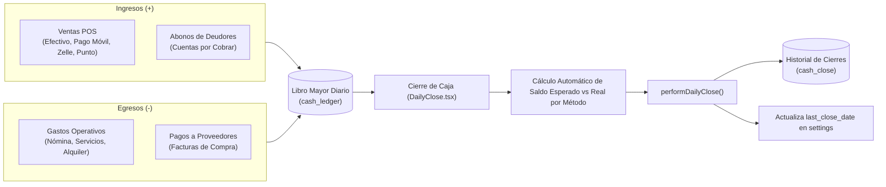

# 🏛️ Arquitectura del Sistema — Glyph Core (Todo en Ruedas)

> **Versión:** 2.0  
> **Ámbito:** ERP, POS, Inventario Multimoneda, Facturación y Control Financiero.  
> **Entorno Operativo:** Mercado venezolano con economía bimonetaria (USD / VES) y soporte para pesos colombianos (COP).

---

## 1. Visión General de la Arquitectura

El sistema está implementado bajo un patrón de **Single Page Application (SPA) desacoplada** con backend gestionado mediante **Backend-as-a-Service (BaaS) en Supabase (PostgreSQL)**, orquestación de estado global modular con **Zustand**, lógica de dominio estricta en TypeScript y extensiones Serverless (Edge Functions) para procesamiento con Inteligencia Artificial.



---

## 2. Capas Principales del Sistema

### 2.1 Capa de Modelos (Domain Entities & Types)
* **Ubicación:** `src/types/index.ts`
* **Responsabilidad:** Representa la **única fuente de verdad** (Single Source of Truth) para las estructuras de datos y tipos en el frontend.
* **Componentes clave:**
  * **Entidades del Negocio:** `Product`, `Client`, `Sale`, `SaleItem`, `Invoice`, `Expense`, `Quote`, `StockMovement`, `CashLedgerEntry`, `Supplier`, `PaymentMethod`.
  * **Tipos de Configuración y Turno:** `AppSettings`, `CashClose`.
  * **Uniones y Enums Tipados:** `CostType` (`'BCV' | 'TH'`), `PriceList` (`'Detal' | 'Mayorista' | 'Especial'`), `SaleStatus`, `UserRole` (`'ADMIN' | 'MANAGER' | 'SELLER' | 'VIEWER'`), `PaymentMethodType`.

---

### 2.2 Capa de Controladores / Orquestación de Estado (State Management)
* **Ubicación:** `src/store/`
* **Tecnología:** Zustand 5 con arquitectura basada en **slices**.
* **Responsabilidad:** Actúa como la capa de controladores lógicos de la aplicación en frontend. Coordina llamadas asíncronas a la base de datos, actualización reactiva del estado, mutaciones optimistas o incrementales y notificaciones visuales (`react-hot-toast`).
* **Estructura:**
  * `useStore.ts`: Instancia global creada con `create<StoreState>()` que compone todos los slices individuales.
  * `types.ts`: Define la interfaz completa `StoreState` y las funciones auxiliares `SetState` y `GetState`.
  * **Slices (`src/store/slices/`):**
    | Slice | Responsabilidad Principal |
    |---|---|
    | `authSlice.ts` | Sesión de usuario, login/logout, recuperación de contraseña y ejecución de `fetchInitialData()` (carga inicial paralela con `Promise.all`). |
    | `saleSlice.ts` | Procesamiento de ventas atómicas mediante RPC, anulación de ventas, registro de pagos/abonos a crédito. |
    | `productSlice.ts` | CRUD de productos, ajuste de inventario y recálculo de stock. |
    | `cartSlice.ts` | Carrito del Punto de Venta (POS) en memoria volátil, cálculo de subtotales, descuentos y listas de precio. |
    | `clientSlice.ts` | Gestión de clientes, validación de límite de crédito (`creditLimit`) y saldo a favor acumulado (`creditBalance`). |
    | `invoiceSlice.ts` | Carga de facturas de compra a proveedores, prorrateo de fletes/impuestos e incremento automático de stock. |
    | `expenseSlice.ts` | Registro de gastos en USD/Bs/COP, gestión de gastos operativos y vinculación a plantillas recurrentes. |
    | `cashLedgerSlice.ts` | Libro mayor de flujo de caja (`cash_ledger`), control unificado de ingresos y egresos. |
    | `quoteSlice.ts` | Creación y ciclo de vida de cotizaciones, conversión directa de cotización a venta. |
    | `returnSlice.ts` | Devoluciones de ventas, generación de Notas de Crédito (NC), reposición de inventario y saldos a favor. |
    | `stockMovementSlice.ts` | Kardex / auditoría de entradas y salidas de inventario. |
    | `supplierSlice.ts` | Directorio y categorización de proveedores. |
    | `settingsSlice.ts` | Configuración de la empresa, tasas de cambio (BCV/Monitor/COP), métodos de pago y cierre de turno. |
    | `userSlice.ts` | Administración de usuarios y asignación de roles. |

---

### 2.3 Capa de Lógica de Negocio y Servicios (Domain Services & Utilities)
* **Ubicación:** `src/utils/` y `src/hooks/`
* **Responsabilidad:** Funciones puras y servicios desacoplados de la interfaz que encapsulan reglas operativas, cálculos matemáticos y contratos de integración.
* **Componentes clave:**
  * **Motor Bimonetario (`src/utils/pricing.ts`):** Aplica márgenes, IVA, listas de precios y la fórmula de "Camuflaje TH":
    * *Producto BCV:* $\text{PVP}_{\text{USD}} = \text{Costo} \times (1 + \text{Margen}) \times (1 + \text{IVA})$, $\text{PVP}_{\text{BS}} = \text{PVP}_{\text{USD}} \times \text{tasa}_{\text{BCV}}$
    * *Producto TH:* Se calcula el precio real en bolívares con la tasa paralela/Monitor y se proyecta a un valor inflado en USD para que en el recibo legal $\text{PVP}_{\text{USD}} \times \text{tasa}_{\text{BCV}}$ equivalga al monto cobrado.
  * **Sistema de Permisos Granulares - RBAC (`src/utils/permissions.ts`):** Matriz de control de accesos que mapea roles (`ADMIN`, `MANAGER`, `SELLER`, `VIEWER`) contra capacidades atómicas (`VIEW_PRODUCTS`, `CREATE_SALE`, `CLOSE_CASH`, etc.).
  * **Servicio de Mapeo DTO/DB (`src/utils/mappers.ts`):** Transforma contratos entre la base de datos en `snake_case` y los objetos del cliente en `camelCase`.
  * **Integración de Tasas de Cambio (`src/utils/fetchRates.ts`):** Conexión con servicios externos (BCV vía DolarVzla, COP vía DolarAPI) con control de timeout por `AbortController`.
  * **Generadores de Documentos (`src/utils/ticketGenerator.ts` & `quoteGenerator.ts`):** Formateo para impresión en tickets térmicos de 80mm, reportes A4 y enlaces dinámicos para envío a WhatsApp.
  * **Sincronización en Tiempo Real (`src/hooks/useRealtimeSync.ts`):** Hook que escucha mutaciones en Supabase Realtime, implementa lógica de debounce y priorización de tablas (`sales`, `products` con alta prioridad) y mecanismo de guardia (`realtimeGuardReasons`) para evitar sobreescritura mientras el usuario opera la caja.

---

### 2.4 Capa de Presentación (UI / Vistas y Componentes)
* **Ubicación:** `src/pages/` y `src/components/`
* **Tecnología:** React 19 + TypeScript + Tailwind CSS (soporte Dark Mode por clases y variables CSS).
* **Responsabilidad:** Renderizado visual, captura de interacciones y delegación inmediata a los slices del store.
* **Aspectos destacados:**
  * **Rutas y Lazy Loading (`src/App.tsx`):** Code-splitting mediante `React.lazy` y `Suspense` para todas las páginas operativas excepto `Login`, `Dashboard` y `Setup`.
  * **Seguridad de Rutas (`src/components/RoleRoute.tsx`):** Barrera en frontend que evalúa permisos o roles permitidos antes de renderizar vistas.
  * **Control de Fallos (`src/components/ErrorBoundary.tsx`):** Aislamiento de errores de renderizado para evitar caídas generales de la SPA.

---

### 2.5 Capa de Persistencia, BaaS y Backend
* **Ubicación:** `src/supabase/client.ts`, `supabase/`
* **Tecnología:** Supabase (PostgreSQL 15+, Auth, Realtime, RLS, Storage, Edge Functions).
* **Responsabilidad:** Almacenamiento seguro, autenticación basada en JWT, transacciones atómicas con bloqueo de concurrencia y funciones sin servidor.
* **Componentes clave:**
  * **PostgreSQL Relacional:** Esquema normalizado (`products`, `clients`, `sales`, `sale_items`, `payments`, `cash_ledger`, etc.).
  * **Row Level Security (RLS):** Reglas en base de datos que validan el rol del usuario autenticado vía `auth.uid()`, actuando como la última línea de defensa.
  * **Procedimiento Atómico Anti-sobreventa (`process_sale_atomic`):** Función en PL/pgSQL que procesa la venta completa en una sola transacción ACID, utilizando `SELECT ... FOR UPDATE` en los productos para prevenir condiciones de carrera y desajustes de inventario.
  * **Edge Function con IA (`supabase/functions/process-invoice`):** Microservicio Deno que recibe imágenes/PDFs de facturas de proveedores, invoca a **Google Gemini 2.5 Flash** con prompting estructurado y retorna un JSON con ítems, costos y datos fiscales para autocompletar la compra.

---

## 3. Dependencias Clave del Proyecto

| Dependencia | Tipo | Versión | Rol Arquitectónico |
|---|---|---|---|
| `react` / `react-dom` | Producción | `^19.2.0` | Núcleo de componentes UI; compatible con optimizaciones del React Compiler. |
| `typescript` | Desarrollo | `~5.9.3` | Tipado estático estricto en todo el codebase. |
| `vite` | Desarrollo | `^7.2.4` | Herramienta de compilación rápida y empaquetado de producción con chunks optimizados. |
| `zustand` | Producción | `^5.0.9` | Gestor de estado global reactivo, liviano y desacoplado por slices. |
| `@supabase/supabase-js` | Producción | `^2.95.3` | SDK de cliente para comunicación con PostgreSQL, Auth, RPC y suscripciones Realtime. |
| `react-router-dom` | Producción | `^7.11.0` | Enrutamiento declarativo del lado del cliente con soporte de layouts y guards. |
| `tailwindcss` | Desarrollo | `^3.4.17` | Sistema de diseño utility-first y tema oscuro dinámico. |
| `react-hot-toast` | Producción | `^2.6.0` | Sistema de notificaciones no intrusivas en español. |
| `recharts` | Producción | `^3.7.0` | Gráficos analíticos para flujo de caja y ventas en el Dashboard. |
| `react-hook-form` & `zod` | Producción | `^7.69.0` / `^4.2.1` | Gestión de formularios y validación de esquemas tipados. |
| `date-fns` | Producción | `^4.1.0` | Manipulación y formateo de fechas locales y cierres contables. |
| `react-to-print` | Producción | `^3.2.0` | Disparo de diálogos de impresión para comandas y tickets de 80mm. |
| `lucide-react` | Producción | `^0.562.0` | Colección estándar de iconografía para toda la interfaz. |
| `vite-plugin-pwa` | Desarrollo | `^1.2.0` | Configuración de Progressive Web App, Service Worker y caché offline (Workbox NetworkFirst). |

---

## 4. Flujos de Datos Principales

### 4.1 Flujo de Autenticación e Inicialización de Datos



---

### 4.2 Flujo de Venta en POS (Transaccional y Anti-sobreventa)



---

### 4.3 Flujo de Sincronización en Tiempo Real Multi-terminal

```mermaid
flowchart TD
    DBMut[Mutación en Base de Datos\n(INSERT/UPDATE/DELETE)] --> RPub[Supabase Realtime Channel]
    RPub --> Hook[useRealtimeSync Hook]
    Hook --> GuardCheck{¿isRealtimeSyncPaused?\n(Guardias activas en POS)}

    GuardCheck -- Sí --> HighOnly{¿Tabla es de alta prioridad\n'products'?}
    HighOnly -- Sí --> FastSync[Actualizar stock silenciosamente]
    HighOnly -- No --> Queue[Encolar actualización hasta que guardia se libere]

    GuardCheck -- No --> Debounce[Debounce Timer\n(150ms tablas altas / 400ms normales)]
    Debounce --> TargetRouter{Router por Tabla}

    TargetRouter -- sales / payments --> FetchSales[fetchSales + fetchProducts]
    TargetRouter -- products --> FetchProd[fetchProducts]
    TargetRouter -- clients --> FetchClients[fetchClients]
    TargetRouter -- expenses / cash_ledger --> FetchLedger[fetchExpenses + fetchCashLedger]
    TargetRouter -- settings --> FetchSettings[fetchSettingsData]

    FetchSales & FetchProd & FetchClients & FetchLedger & FetchSettings --> UpdateZustand[Actualización Incremental de Zustand]
    UpdateZustand --> ReRender[Re-renderizado selectivo en UI]
```

---

### 4.4 Flujo de Carga Mágica de Facturas con IA



---

### 4.5 Flujo Contable: Caja Diaria y Arqueo de Turno



---

## 5. Matriz de Seguridad y Políticas de Acceso (RBAC y RLS)

El sistema opera una estrategia de **doble barrera**:
1. **Frontend (Capa Preventiva):** Evaluada con `src/utils/permissions.ts` y componentes `RoleRoute` y `ProtectedAction`. Si un usuario carece del rol o permiso, la interfaz oculta botones y bloquea el acceso a rutas URL.
2. **Backend (Capa Defensiva):** Regulada mediante **Row Level Security (RLS)** en PostgreSQL con políticas que validan la sesión activa y el rol almacenado en el perfil.

| Módulo / Recurso | ADMIN | MANAGER | SELLER | VIEWER |
|---|:---:|:---:|:---:|:---:|
| **POS (Caja y Ventas)** | Total | Total | Operación propia | Solo lectura |
| **Inventario (CRUD y Costos)** | Total | Total | Bloqueado | Solo lectura |
| **Movimientos / Kardex** | Total | Total | Bloqueado | Solo lectura |
| **Gastos y Egresos** | Total | Total | Bloqueado | Bloqueado |
| **Cotizaciones** | Total | Total | Propias | Solo lectura |
| **Cuentas por Cobrar** | Total | Total | Solo consulta | Solo lectura |
| **Facturas de Proveedor** | Total | Total | Bloqueado | Solo lectura |
| **Cierre de Caja** | Total | Total | Bloqueado | Bloqueado |
| **Comisiones de Venta** | Total | Total | Bloqueado | Bloqueado |
| **Configuración y Tasas** | Total | Limitado (tasas) | Bloqueado | Bloqueado |
| **Gestión de Usuarios** | Total | Bloqueado | Bloqueado | Bloqueado |
| **Auditoría del Sistema** | Total | Bloqueado | Bloqueado | Bloqueado |

---

## 6. Estructura de Directorios del Código Fuente

```text
c:\Users\Khris\dev\todo-en-ruedas\
├── src/
│   ├── App.tsx                   # Enrutador central, Suspense, Lazy Loading y RoleRoutes
│   ├── main.tsx                  # Punto de entrada de la aplicación React 19
│   ├── index.css                 # Estilos globales de Tailwind CSS y variables de tema
│   ├── types/
│   │   └── index.ts              # ÚNICA fuente de tipos de dominio y modelos
│   ├── store/
│   │   ├── useStore.ts           # Store central de Zustand (composición de slices)
│   │   ├── types.ts              # Interfaz StoreState y tipos de despacho
│   │   └── slices/               # 14 Slices modulares de estado y controladores
│   ├── components/
│   │   ├── layout/               # TopBar, Sidebar y navegación
│   │   ├── pos/                  # Componentes de caja (CheckoutModal, ProductCard)
│   │   ├── dashboard/            # Tarjetas de flujo de caja y tablas analíticas
│   │   ├── ErrorBoundary.tsx     # Capturador de excepciones en tiempo de renderizado
│   │   ├── RoleRoute.tsx         # Guardián de rutas según RBAC
│   │   └── GlobalSearch.tsx      # Buscador global omnibox
│   ├── pages/                    # Vistas completas de la aplicación (19 módulos)
│   ├── hooks/
│   │   ├── useRealtimeSync.ts    # Sincronizador WebSocket con priorización y debounce
│   │   ├── usePermissions.ts     # Hook para consulta ágil de permisos del usuario
│   │   ├── useDarkMode.ts        # Persistencia y toggling de modo oscuro
│   │   └── useSetupCheck.ts      # Detección de primer arranque del sistema
│   ├── utils/
│   │   ├── pricing.ts            # Motor matemático bimonetario (BCV vs TH)
│   │   ├── permissions.ts        # Definición de permisos y matriz RBAC
│   │   ├── mappers.ts            # Transformadores DB (snake_case) ↔ App (camelCase)
│   │   ├── fetchRates.ts         # Conectores HTTP para tasas BCV y COP
│   │   └── ticketGenerator.ts    # Generación de tickets de impresión y WhatsApp
│   └── supabase/
│       └── client.ts             # Instancia singleton del cliente Supabase
├── supabase/
│   ├── schema.sql                # DDL completo de PostgreSQL (tablas, índices, RLS)
│   ├── migrations/               # Scripts incrementales de migración
│   └── functions/
│       └── process-invoice/      # Edge Function Deno (OCR + Gemini 2.5 Flash)
├── vite.config.ts                # Configuración de empaquetado Vite y Workbox PWA
└── package.json                  # Dependencias y scripts de construcción
```
